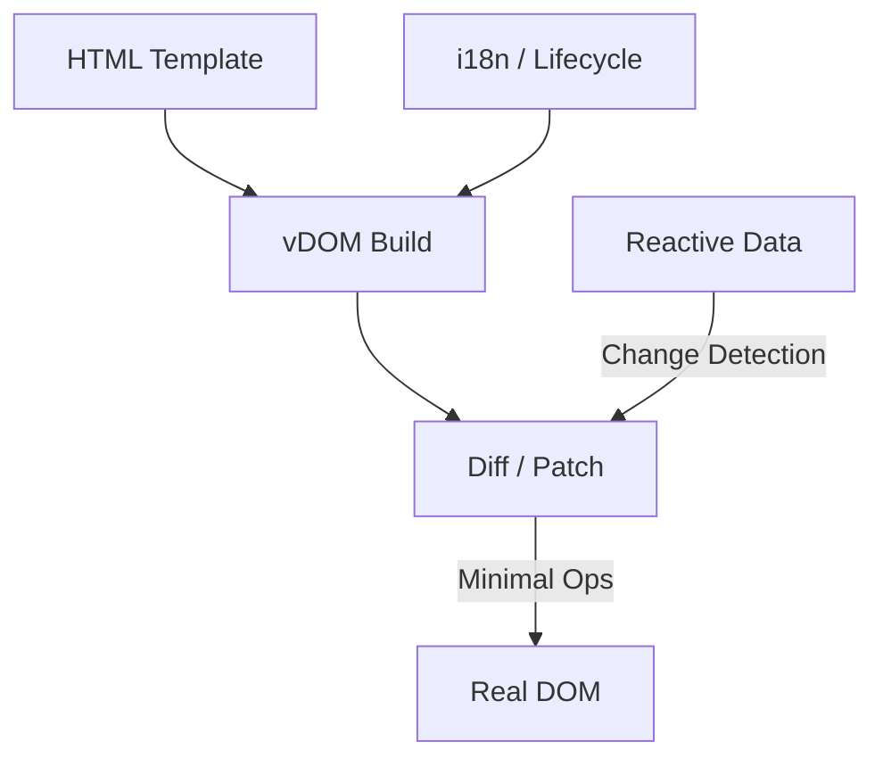

> [!NOTE]
> This README was generated by [SKILL](https://github.com/pardnchiu/skill-readme-generate), get the ZH version from [here](./doc/README.zh.md).

***

<picture>

</picture>

<strong>A LIGHTWEIGHT VIRTUAL DOM FRONTEND FRAMEWORK BUILT ON PURE JAVASCRIPT</strong>

***

> A lightweight JavaScript frontend framework with virtual DOM rendering, declarative template syntax, and built-in i18n

## Table of Contents

- [Features](#features)
- [Built With](#built-with)
- [Architecture](#architecture)
- [License](#license)
- [Author](#author)
- [Stars](#stars)

## Features

> `npm i @pardnchiu/quickui` · [Documentation](./doc/doc.md)

- **Zero-dependency virtual DOM engine** — Pure JavaScript with native browser APIs implements a Diff/Patch algorithm, applying minimal DOM operations without relying on any third-party library.
- **Declarative template syntax** — Bind data, loop, and render conditionally directly in HTML with `{{ value }}`, `:for`, `:if`/`:else-if`/`:else`, and `:model`, with no build step required.
- **Proxy-based reactive data** — Data changes are auto-detected and trigger the smallest possible DOM update, removing manual DOM manipulation.
- **Built-in i18n** — Switch languages through JSON locale files and the `i18n.key` syntax without integrating an extra translation framework.
- **Full lifecycle hooks** — Six lifecycle stages are exposed: `beforeRender`, `rendered`, `beforeUpdate`, `updated`, `beforeDestroy`, `destroyed`.

## Built With

## Architecture

> [Full Architecture](./doc/architecture.md)

## License

This project is licensed under the [MIT License](LICENSE).

## Author

<h4 style="padding-top: 0">邱敬幃 Pardn Chiu</h4>

<a href="mailto:hi@pardn.io">hi@pardn.io</a> 
<a href="https://www.linkedin.com/in/pardnchiu">https://www.linkedin.com/in/pardnchiu</a>

## Stars

***

©️ 2024 [邱敬幃 Pardn Chiu](https://www.linkedin.com/in/pardnchiu)
