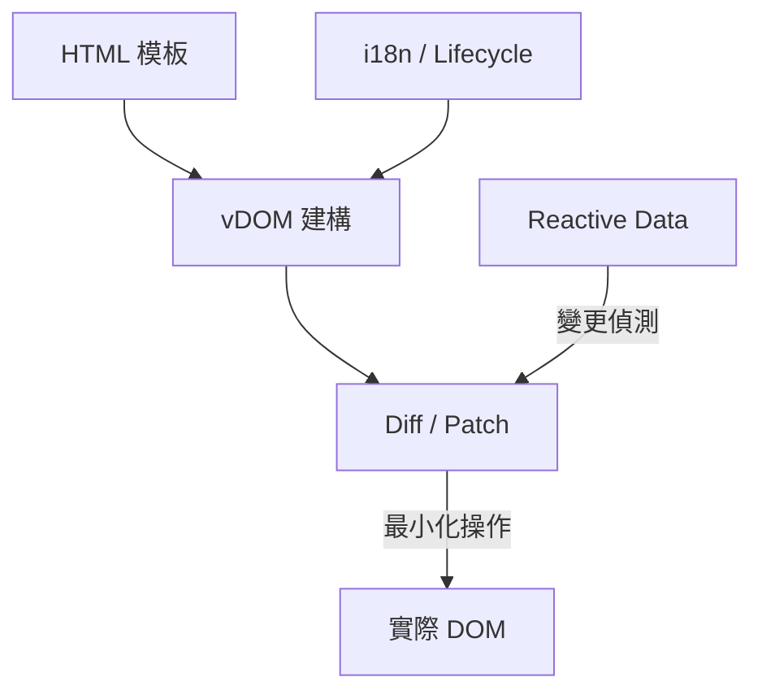

> [!NOTE]
> 此 README 由 [SKILL](https://github.com/pardnchiu/skill-readme-generate) 生成，英文版請參閱 [這裡](../README.md)。

***

<picture>

</picture>

<strong>A LIGHTWEIGHT VIRTUAL DOM FRONTEND FRAMEWORK BUILT ON PURE JAVASCRIPT</strong>

***

> 基於純 JavaScript 與原生 API 的輕量化前端框架，具備虛擬 DOM 渲染、宣告式模板語法與內建 i18n

## 目錄

- [功能特點](#功能特點)
- [技術堆疊](#技術堆疊)
- [架構](#架構)
- [授權](#授權)
- [Author](#author)
- [Stars](#stars)

## 功能特點

> `npm i @pardnchiu/quickui` · [完整文件](./doc.zh.md)

- **零依賴虛擬 DOM 引擎** — 純 JavaScript 搭配瀏覽器原生 API 實作 Diff/Patch 演算法，不依賴任何第三方函式庫即可完成最小化的畫面更新。
- **宣告式模板語法** — 直接在 HTML 中使用 `{{ value }}`、`:for`、`:if`/`:else-if`/`:else`、`:model` 等屬性完成資料綁定、迴圈與條件渲染，無需額外編譯工具。
- **Proxy 響應式資料** — 資料變更時自動偵測差異並觸發最小範圍的 DOM 更新，省去手動操作 DOM 的流程。
- **內建 i18n 多語系** — 透過 JSON 語系檔與 `i18n.key` 語法即可切換語言，無需整合額外的翻譯框架。
- **完整生命週期鉤子** — 提供 `beforeRender`、`rendered`、`beforeUpdate`、`updated`、`beforeDestroy`、`destroyed` 六個階段的鉤子函數。

## 技術堆疊

## 架構

> [完整架構](./architecture.zh.md)

## 授權

本專案採用 [MIT License](../LICENSE)。

## Author

<h4 style="padding-top: 0">邱敬幃 Pardn Chiu</h4>

<a href="mailto:hi@pardn.io">hi@pardn.io</a> 
<a href="https://www.linkedin.com/in/pardnchiu">https://www.linkedin.com/in/pardnchiu</a>

## Stars

***

©️ 2024 [邱敬幃 Pardn Chiu](https://www.linkedin.com/in/pardnchiu)
