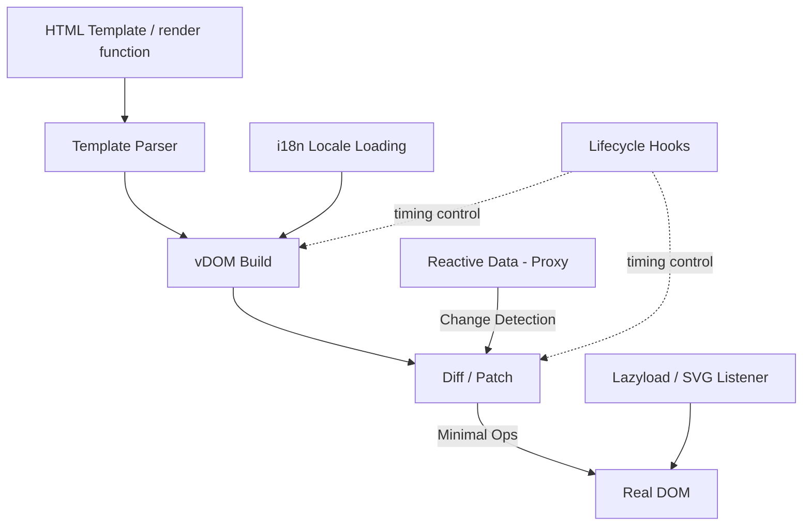
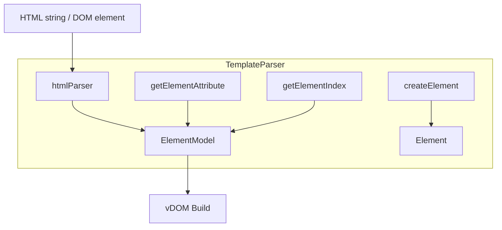
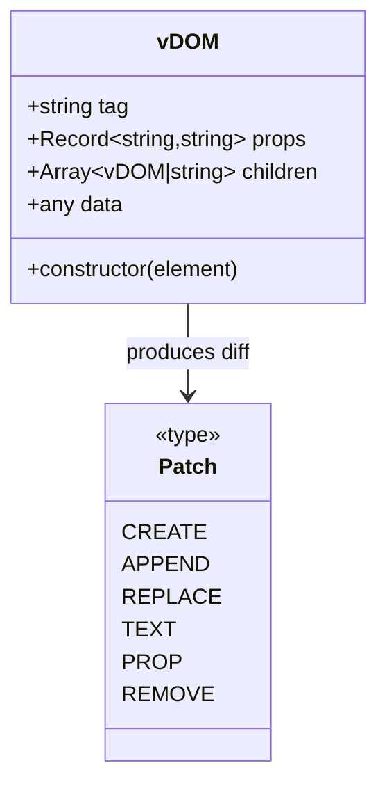
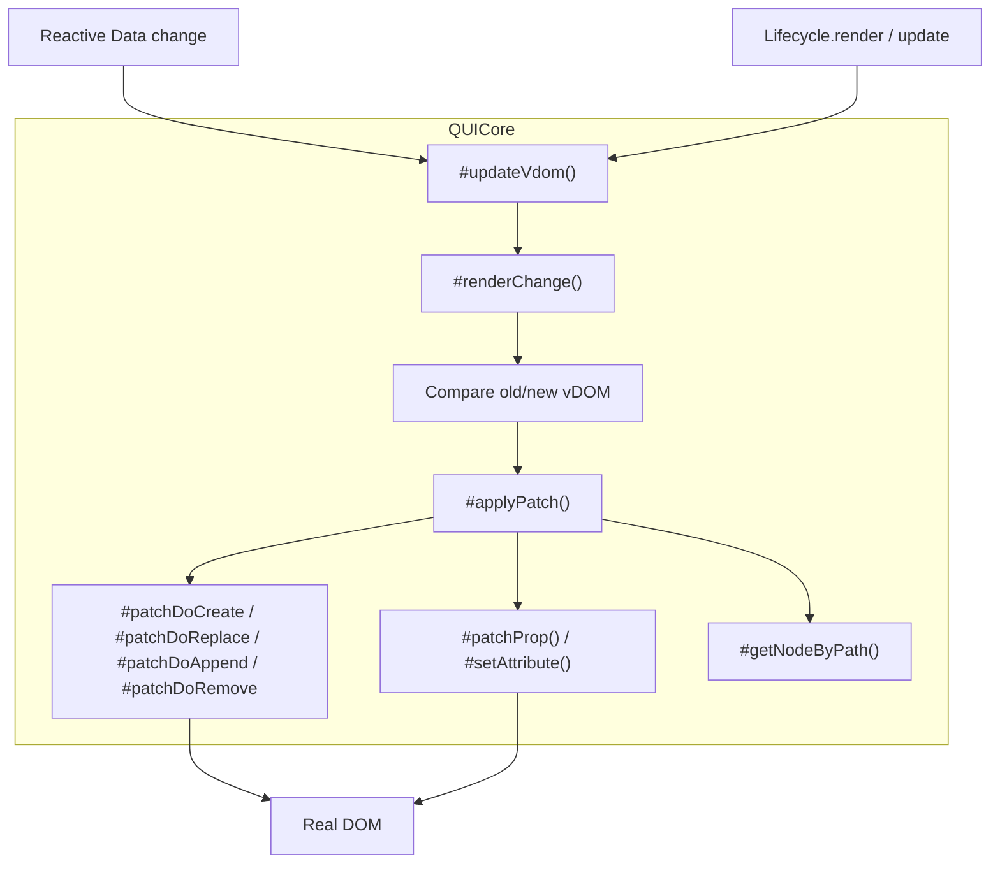
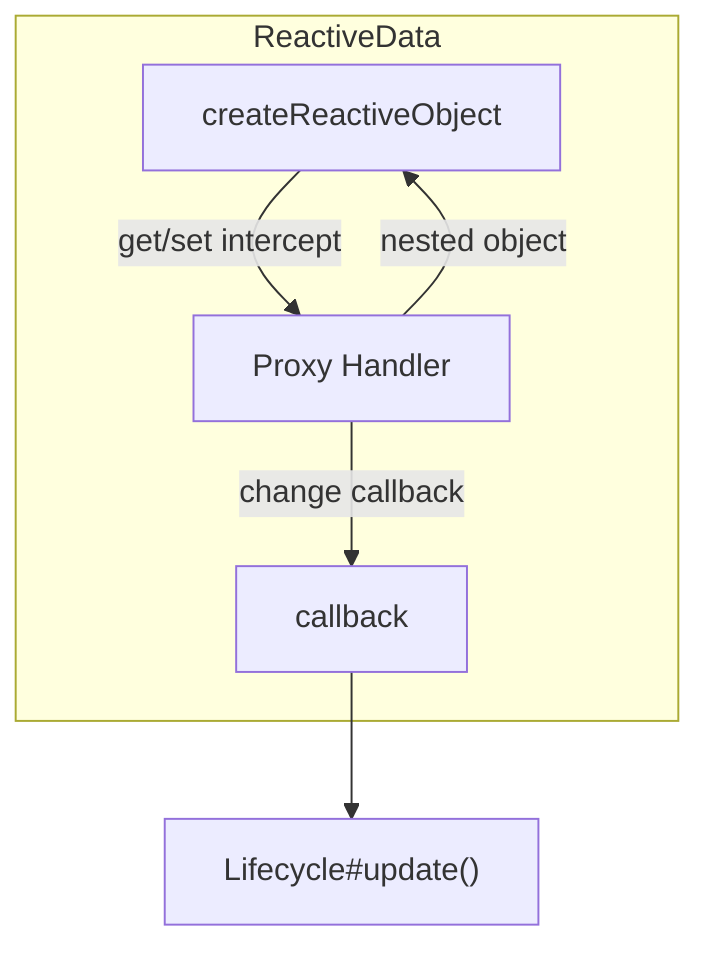
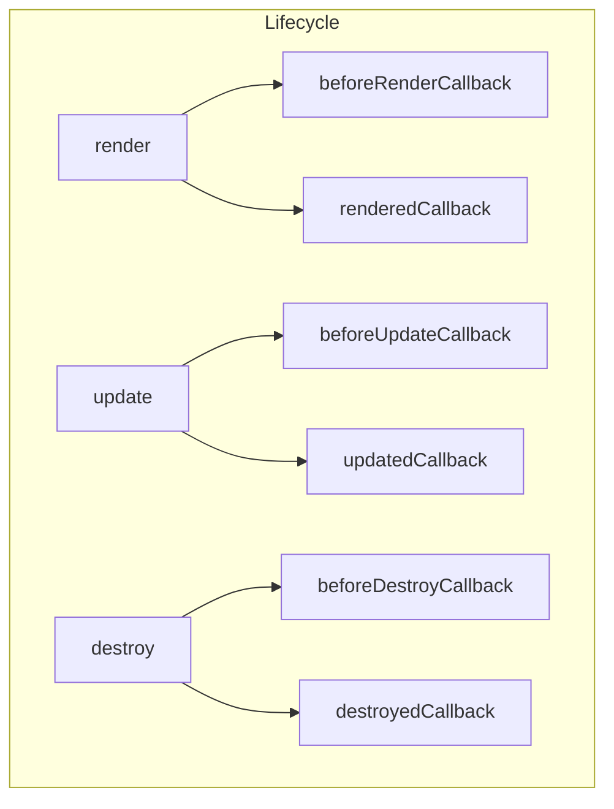
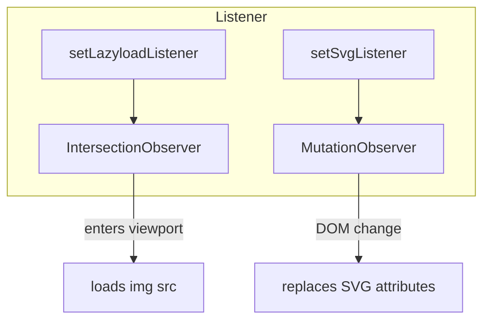
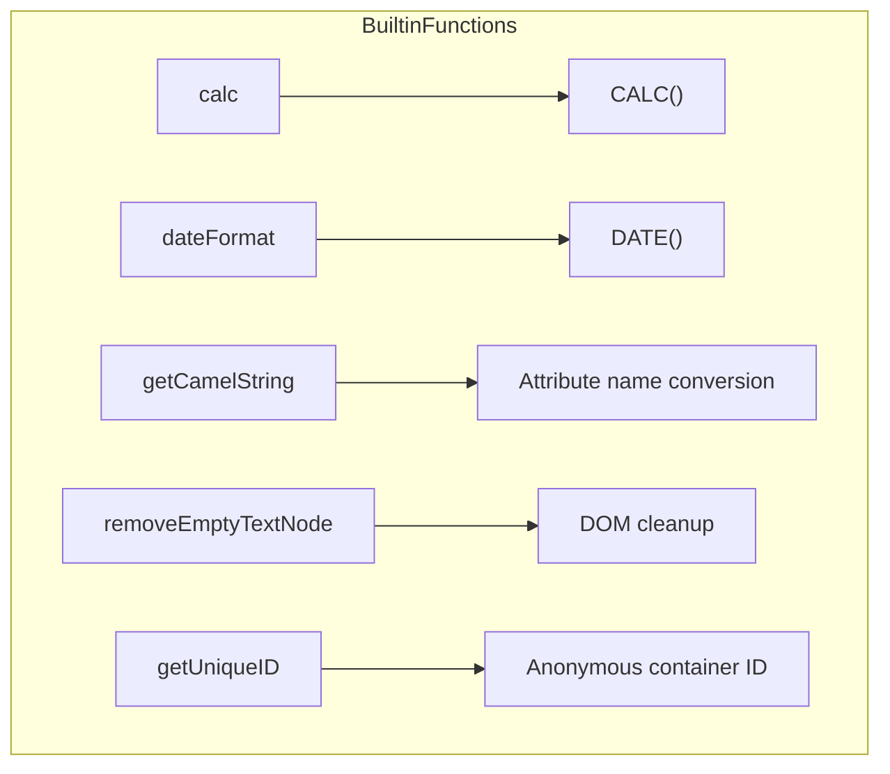
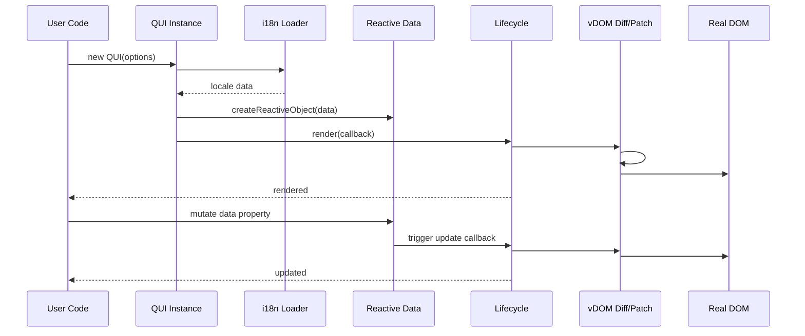
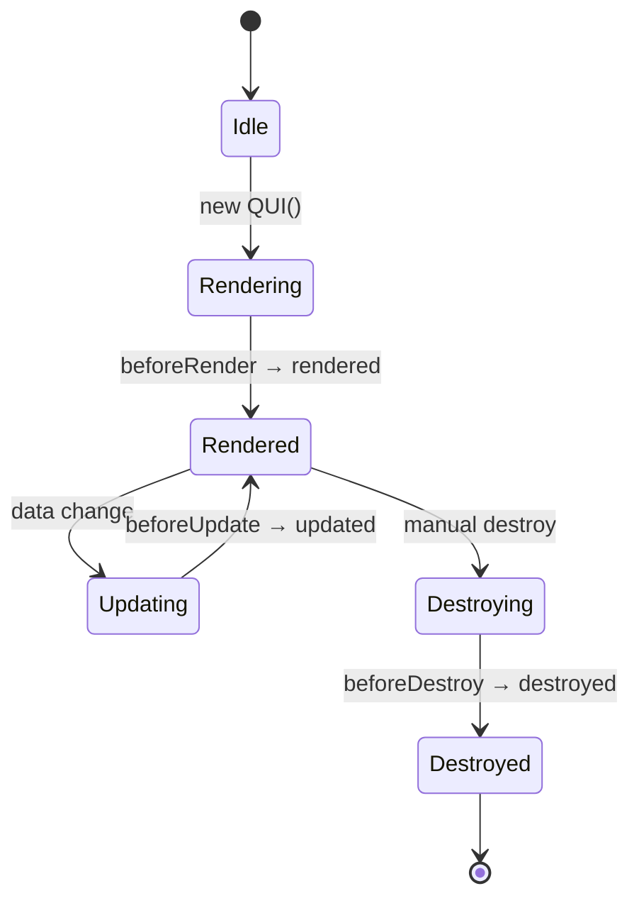

# QuickUI - Architecture

> Back to [README](../README.md)

## Overview

## Module: Template Parser

Parses HTML strings or DOM elements into a structured element model (tag / id / class / attributes / children).

## Module: vDOM

The `vDOM` class converts a DOM element into a lightweight object representation (tag / props / children / data) that the diff algorithm compares between renders.

## Module: QUI Core (Diff / Patch / Render Scheduling)

## Module: Reactive Data

Recursively wraps the data object with a `Proxy`, intercepting property reads/writes and invoking a change callback that `Lifecycle.update` schedules into `#updateVdom`.

## Module: Lifecycle

Manages the callbacks for the six lifecycle stages and wraps the timing of render, update, and destroy.

## Module: Listener (Lazyload / SVG)

## Module: Built-in Functions

The set of utility functions available in template `{{ }}` interpolation and attribute bindings.

## Data Flow

The complete request flow from initialization to a rendered update:

## State Machine

State transitions of a QUI instance across its lifecycle stages:

***

©️ 2024 [邱敬幃 Pardn Chiu](https://www.linkedin.com/in/pardnchiu)
