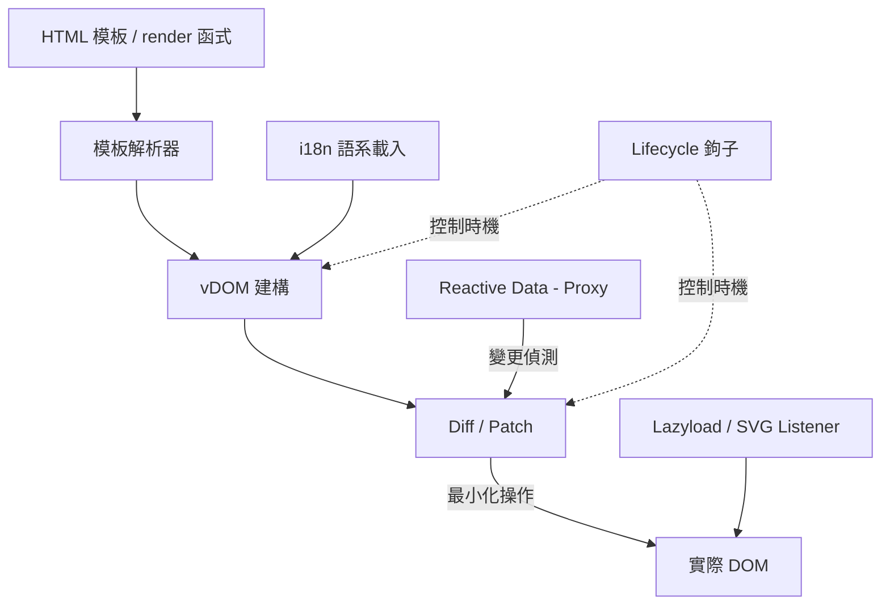
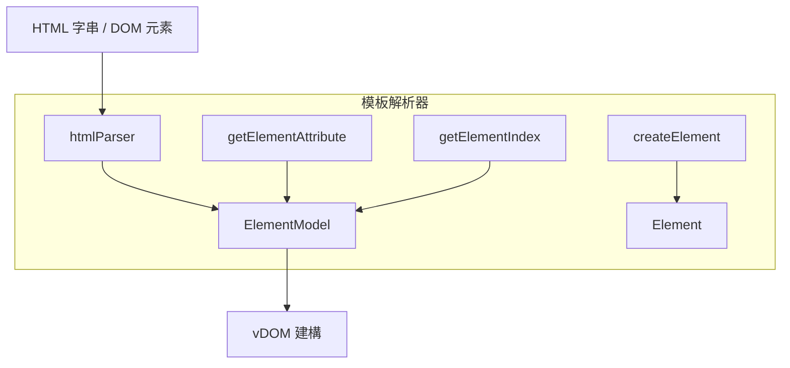
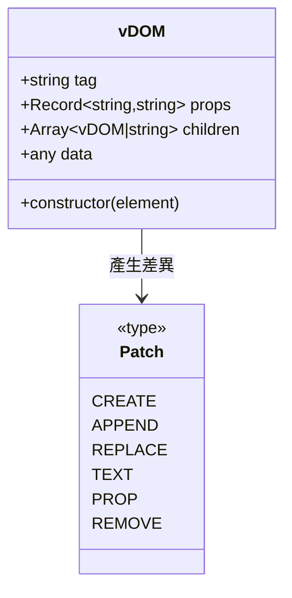
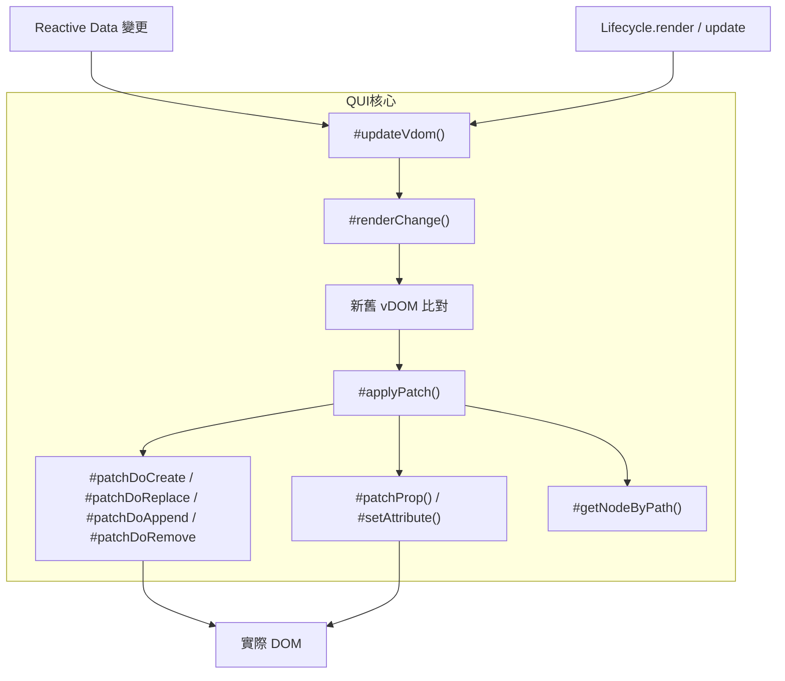
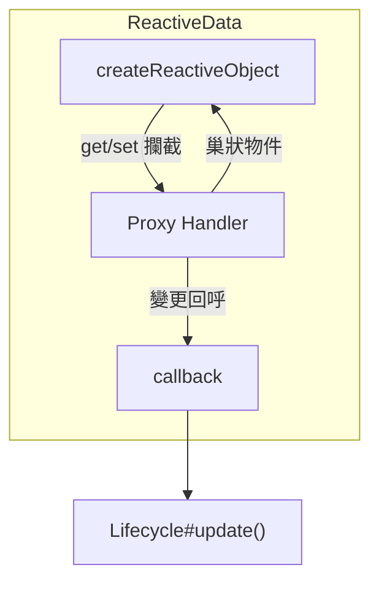
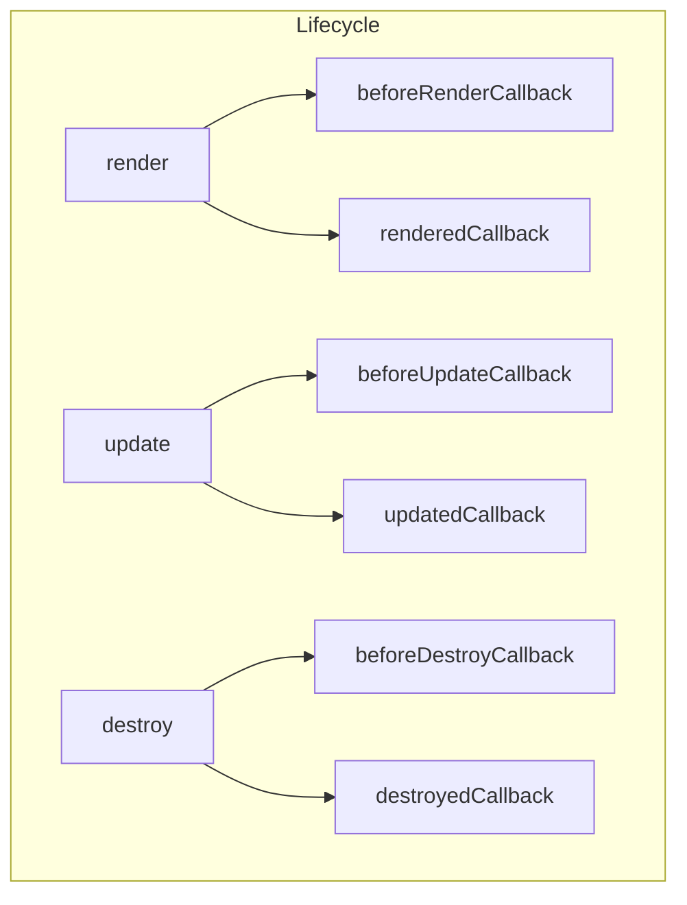
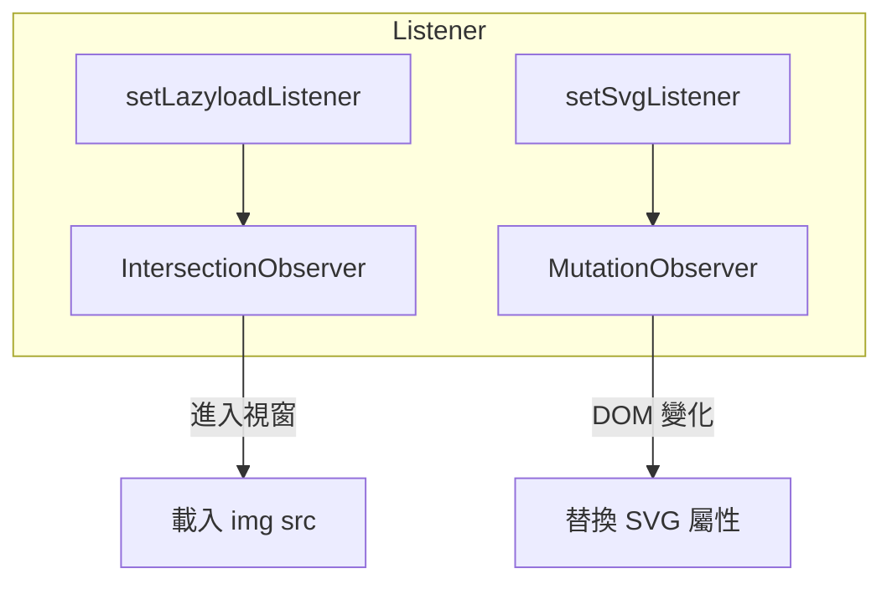
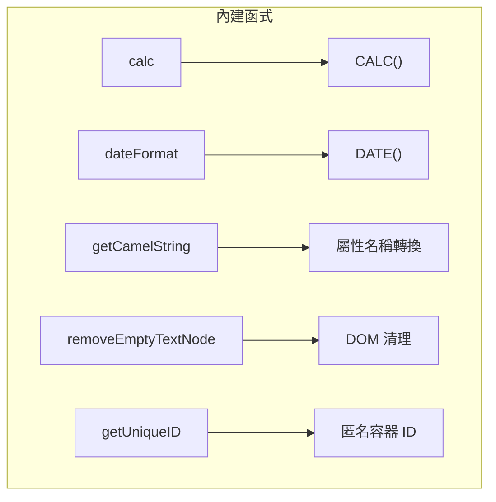
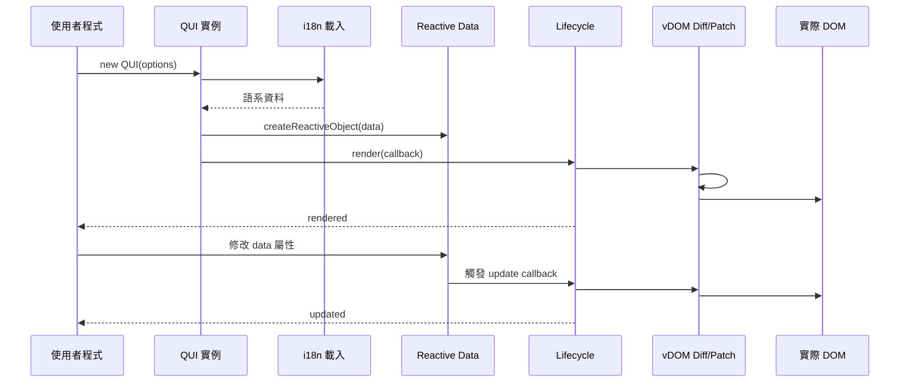
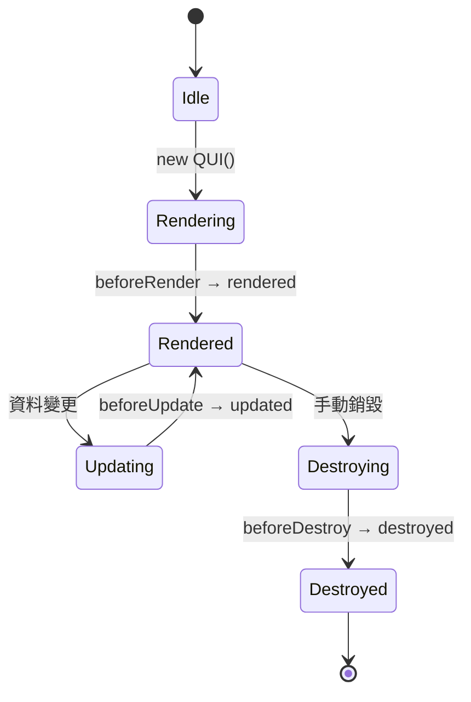

# QuickUI - 架構

> 返回 [README](./README.zh.md)

## 概覽

## 模組：模板解析器

負責將 HTML 字串或 DOM 元素解析為結構化的元素模型（tag / id / class / attributes / children）。

## 模組：vDOM

`vDOM` 類別將 DOM 元素轉換為輕量物件表示（tag / props / children / data），供 Diff 演算法比對前後差異。

## 模組：QUI 核心（Diff / Patch / 渲染排程）

## 模組：Reactive Data

透過 `Proxy` 遞迴代理資料物件，屬性讀寫時攔截並回呼變更事件，交由 `Lifecycle.update` 排程觸發 `#updateVdom`。

## 模組：Lifecycle

管理六個生命週期階段的回呼函數，並包裝渲染／更新／銷毀的執行時機。

## 模組：Listener（Lazyload / SVG）

## 模組：內建函式

供模板 `{{ }}` 插值與屬性綁定使用的工具函式集合。

## 資料流

從初始化到畫面更新的完整請求流程：

## 狀態機

QUI 實例在生命週期各階段間的狀態轉換：

***

©️ 2024 [邱敬幃 Pardn Chiu](https://www.linkedin.com/in/pardnchiu)
